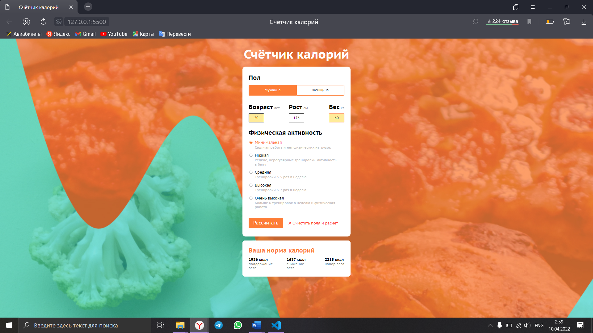

# Счетчик калорий

## Состояние по умолчанию:
+ Выбран мужской пол.
+ В полях ввода стоит 0.
+ Выбрана «минимальная» физическая активность.
+ Кнопка «Рассчитать» неактивна.
+ Кнопка сброса данных из полей ввода неактивна.
+ Блок с выводом информации о калориях скрыт.

После того как в поля ввода таких как возраст, рост и вес будут введены числа ваших параметров и нажата кнопка "Расчитать" появится заголовок "Ваша норма калорий" и расчет калорий по норме потребления калорий, также если вы хотите набрать или скинуть килограммы.

В данном проекте были использованы такие технологии как html, css и js.

## Установить

Чтобы сохранить код на свою локальную машину откройте git bash и введите команду git clone https://github.com/dron-olya7/calories-calculator

Далее откройте Visual Studio Code и откройте папку либо через файл -> открыть папку -> выберете папку calories-calculator либо через набор клавиш таких как ctrl+K+O и также выберете папку calories-calculator. 

Откройте в браузере с помощью установленного live server. Внизу в VSCode нажмите на Go live.

